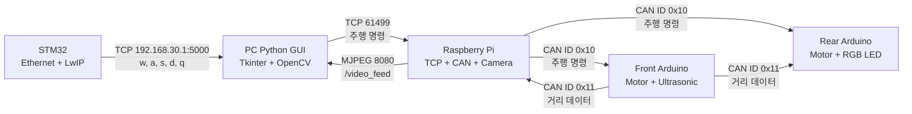

# Communication-Control_term

TCP/IP와 CAN 통신을 결합하여 **PC, STM32, Raspberry Pi, Arduino 노드가 협력하는 4WD 로봇 제어 시스템**을 구현한 프로젝트입니다.

PC GUI 또는 STM32 스위치 입력으로 주행 명령을 전달하고, Raspberry Pi가 이를 CAN 메시지로 변환하여 전·후방 Arduino 제어 노드에 전송합니다. 전방 초음파 센서의 거리 데이터는 CAN과 TCP를 거쳐 PC GUI에 표시되며, Raspberry Pi 카메라 영상도 실시간으로 스트리밍합니다.

---

## 1. 주요 기능

- PC GUI를 이용한 전진·후진·좌회전·우회전·정지 제어
- STM32 Ethernet/LwIP 기반 원격 명령 입력
- Raspberry Pi TCP 서버와 CAN 게이트웨이
- Raspberry Pi 카메라 MJPEG 스트리밍
- 전·후방 Arduino 모터 분산 제어
- 초음파 센서를 이용한 전방 장애물 감지
- 15 cm 이내 장애물 감지 시 비상 정지
- 거리 상태에 따른 후방 RGB LED 표시
- PC GUI에서 실시간 거리 및 영상 확인

---

## 2. 시스템 구성



### 통신 흐름

1. 사용자가 PC GUI 버튼 또는 키보드로 주행 명령을 입력합니다.
2. PC가 Raspberry Pi TCP 서버로 `w`, `a`, `s`, `d`, `q` 명령을 전송합니다.
3. Raspberry Pi가 명령을 CAN ID `0x10`으로 변환합니다.
4. 전·후방 Arduino가 CAN 명령을 수신하여 모터를 제어합니다.
5. Front Arduino가 초음파 거리를 CAN ID `0x11`로 전송합니다.
6. Rear Arduino는 거리 정보에 따라 LED와 비상 정지를 제어합니다.
7. Raspberry Pi는 거리 데이터를 PC GUI에 전달하고 카메라 영상을 스트리밍합니다.
8. STM32 입력을 사용할 경우 PC의 TCP 게이트웨이가 STM32 명령을 Raspberry Pi로 전달합니다.

---

## 3. 저장소 구조

```text
Communication-Control_term/
├── arduino/
│   ├── FrontCAN/
│   │   └── FrontCAN.ino
│   └── RearCAN/
│       └── RearCAN.ino
├── python/
│   ├── pc_controller/
│   │   └── remote_control_gui.py
│   └── tests/
│       └── stm32_tcp_server_test.py
├── raspberry_pi/
│   └── rpi_server.py
├── stm32/
│   └── term_project/
│       ├── Core/
│       ├── Drivers/
│       ├── LWIP/
│       ├── Middlewares/
│       └── term_project.ioc
├── docs/
├── .gitignore
└── README.md
```

---

## 4. 구성 요소별 역할

### PC Python GUI

`python/pc_controller/remote_control_gui.py`

- Raspberry Pi TCP 서버 접속
- `w`, `a`, `s`, `d`, `q` 주행 명령 송신
- Raspberry Pi 카메라 영상 수신
- 초음파 거리 데이터 표시
- STM32 TCP 명령을 Raspberry Pi로 전달

| 명령 | 동작 |
|---|---|
| `w` | 전진 |
| `s` | 후진 |
| `a` | 좌회전 |
| `d` | 우회전 |
| `q` | 정지 |

### Raspberry Pi

`raspberry_pi/rpi_server.py`

- PC 명령 수신용 TCP 서버
- SocketCAN 기반 CAN 송수신
- CAN ID `0x10`으로 주행 명령 송신
- CAN ID `0x11` 거리 데이터 수신
- Picamera2 및 Flask 기반 영상 스트리밍
- 거리 데이터를 PC GUI로 전달

### Front Arduino

`arduino/FrontCAN/FrontCAN.ino`

- 전방 모터 2개 제어
- 초음파 센서 거리 측정
- 15 cm 이내 장애물 감지 시 전방 모터 정지
- 거리 데이터를 CAN ID `0x11`로 0.3초마다 송신
- Raspberry Pi의 CAN ID `0x10` 명령 수신

### Rear Arduino

`arduino/RearCAN/RearCAN.ino`

- 후방 모터 2개 제어
- CAN ID `0x11` 거리 데이터 수신
- 위험도에 따른 RGB LED 표시
- 15 cm 이내에서 후방 모터도 강제 정지
- Raspberry Pi의 CAN ID `0x10` 명령 수신

| 거리 | 상태 | LED |
|---|---|---|
| 15 cm 미만 | 위험 및 비상 정지 | 빨강 |
| 15 cm 이상 40 cm 미만 | 주의 | 주황 |
| 40 cm 이상 주행 중 | 안전 | 초록 |
| 정지 상태 | 대기 | 파랑 |

### STM32

`stm32/term_project/`

- STM32F429 기반 Ethernet 통신
- LwIP TCP 클라이언트
- PC TCP 서버에 주행 명령 송신
- 스위치 입력 기반 원격 제어

```c
#define DEST_IP_ADDR0 192
#define DEST_IP_ADDR1 168
#define DEST_IP_ADDR2 30
#define DEST_IP_ADDR3 1

#define DEST_PORT 5000
```

---

## 5. 통신 설정

| 구분 | 설정 |
|---|---|
| PC → Raspberry Pi TCP 포트 | `61499` |
| Raspberry Pi 영상 포트 | `8080` |
| 영상 경로 | `/video_feed` |
| Raspberry Pi CAN 인터페이스 | `can0` |
| CAN 속도 | `500 kbps` |
| 명령 CAN ID | `0x10` |
| 전방 거리 CAN ID | `0x11` |
| Rear Arduino ID | `0x12` |
| STM32 IP | `192.168.30.101` |
| STM32 목적지 PC IP | `192.168.30.1` |
| STM32 TCP 포트 | `5000` |

> IP 주소는 네트워크 환경에 따라 달라질 수 있으므로 실행 전에 PC와 Raspberry Pi의 실제 주소를 확인해야 합니다.

---

## 6. 실행 환경

### PC Python 패키지

```bash
pip install opencv-python numpy pillow
```

Tkinter는 일반적으로 Python 설치에 포함되어 있습니다.

### Raspberry Pi 패키지

```bash
sudo apt update
sudo apt install python3-picamera2 python3-opencv can-utils
pip install python-can flask
```

### Arduino 라이브러리

- `SPI`
- `mcp_can`
- MCP2515 CAN 모듈 설정: `500 kbps`, `8 MHz`

### STM32

- STM32CubeIDE
- STM32CubeMX
- STM32 HAL
- LwIP Middleware
- STM32F429 계열 보드

---

## 7. 실행 방법

### 7.1 Raspberry Pi CAN 인터페이스 활성화

```bash
sudo ip link set can0 down
sudo ip link set can0 type can bitrate 500000
sudo ip link set can0 up
```

상태 확인:

```bash
ip -details link show can0
```

CAN 수신 테스트:

```bash
candump can0
```

### 7.2 Raspberry Pi 서버 실행

```bash
cd raspberry_pi
python3 rpi_server.py
```

정상 실행 시 다음 기능이 시작됩니다.

- TCP 명령 서버: `61499`
- 카메라 스트리밍 서버: `8080`
- CAN 송수신 스레드

### 7.3 PC GUI 설정

`remote_control_gui.py`에서 Raspberry Pi IP를 실제 주소로 수정합니다.

```python
RPI_IP = "172.20.10.2"
PORT = 61499
STREAM_URL = f"http://{RPI_IP}:8080/video_feed"
```

실행:

```bash
cd python/pc_controller
python remote_control_gui.py
```

### 7.4 Arduino 업로드

Arduino IDE에서 각각 업로드합니다.

```text
arduino/FrontCAN/FrontCAN.ino
arduino/RearCAN/RearCAN.ino
```

두 노드 모두 MCP2515 CAN 통신 속도가 `500 kbps`로 동일해야 합니다.

### 7.5 STM32 실행

1. STM32CubeIDE에서 `stm32/term_project`를 Import합니다.
2. 프로젝트를 Build합니다.
3. STM32에 Flash합니다.
4. PC Ethernet 주소를 `192.168.30.1`로 설정합니다.
5. PC GUI 또는 STM32 TCP 테스트 서버를 먼저 실행합니다.

STM32 통신만 확인할 때:

```bash
cd python/tests
python stm32_tcp_server_test.py
```

---

## 8. 비상 정지 동작

Front Arduino는 초음파 센서로 측정한 거리가 15 cm 미만일 경우 전방 모터를 정지합니다.

동일한 거리 데이터가 CAN ID `0x11`로 Rear Arduino에 전달되며, Rear Arduino도 후방 모터를 정지합니다. 비상 정지 상태에서는 전진 명령 `w`가 입력되어도 정지 상태를 유지합니다.

```text
거리 < 15 cm
    ↓
Front Arduino 정지
    ↓ CAN ID 0x11
Rear Arduino 정지
    ↓ TCP
PC GUI 위험 표시
```

---

## 9. 테스트 항목

- [ ] Raspberry Pi에서 `can0` 활성화 확인
- [ ] Front Arduino CAN ID `0x11` 거리 송신 확인
- [ ] Rear Arduino 거리 데이터 수신 확인
- [ ] PC GUI와 Raspberry Pi TCP 연결 확인
- [ ] `w`, `a`, `s`, `d`, `q` 명령 동작 확인
- [ ] 15 cm 이내 비상 정지 확인
- [ ] RGB LED 거리 상태 표시 확인
- [ ] 카메라 영상 스트리밍 확인
- [ ] STM32에서 PC로 TCP 명령 송신 확인

---

## 10. 향후 개선 사항

- IP 주소와 포트를 별도 설정 파일로 분리
- TCP 연결 끊김 시 자동 재접속 기능 추가
- CAN 데이터 범위 및 오류 검증 강화
- 초음파 거리 데이터 자료형 개선
- 카메라 프레임 처리 성능 최적화
- 다중 TCP 클라이언트 관리 구조 개선
- 명령 수신 타임아웃 기반 안전 정지 추가
- 시스템 구성도와 실제 제작 사진 추가

---

## 11. 프로젝트 결과 자료

`docs/` 폴더에 다음 자료를 추가할 예정입니다.

- 시스템 구성도
- CAN 배선도
- STM32 Ethernet 연결도
- 제작 사진
- PC GUI 실행 화면
- 주행 및 장애물 감지 영상
- 세미나 발표 자료

---

## 12. 작성자

- **Dongjin Kim**
- Mechatronics Engineering
